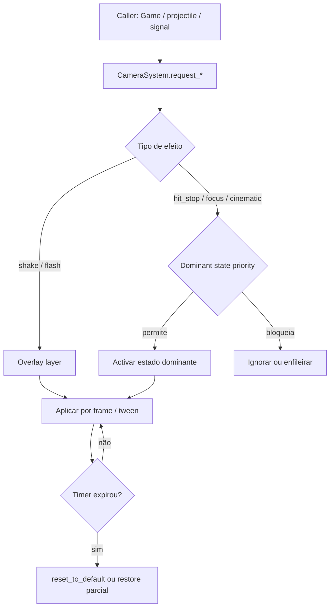

# Sistema de Câmera — Arquitetura Oficial

**Implementação v1 (o que já está no código):** [camera_implementacao_v1.txt](camera_implementacao_v1.txt)

Documento de design e referência de implementação. Alinhado a Godot **4.6**, viewport **1920 × 864** (proporção **2,22 : 1**), cena de duelo `levels/duel/main.tscn` e coordenação em `levels/duel/game.gd`.

Referências internas: [handoff_projeto.txt](handoff_projeto.txt), [sistemas_core_arena_e_movimento.md](sistemas_core_arena_e_movimento.md), [staging_stages.txt](staging_stages.txt).

> **Nota:** a pasta `docs-godot_documentation` não existe neste repositório. Convenções Godot do projeto estão em [project_organization.rst](project_organization.rst).

---

## Piloto v1 — Esqueleto (Feixe)

Implementado em `levels/duel/camera/`. Integração **apenas** via `Game` → `CameraSystem`.

| Acção Esqueleto | Câmera |
|-----------------|--------|
| Tiro carregado (disparo / impacto) | **Nenhuma** |
| Feixe — soltar carga | `presets/esqueleto_feixe_fire.tres` |
| Feixe — impacto | `presets/esqueleto_feixe_hit.tres` |
| Buff G/Y, dash | **Nenhuma** |
| ULT Chuva — armagem/anim | `esqueleto_ult_chuva_arm.tres` + `play_ult_super_focus_sequence` |
| ULT Chuva — fase efeito | `set_ambient_shake` contínuo leve (sem parar jogadores) |
| **Hit leve (flecha genérica)** | `presets/hit_light.tres` — shake 6px, flash fraco, hit stop 0,03s |
| **Clutch (HP &lt; 15%)** | `set_clutch_overlay` + `set_ambient_shake` ~2,5px |
| **KO de round (HP = 0, Vs)** | `play_ko_round_sequence` + letterbox — ver § Piloto KO |
| Intro partida (round 1) | `_play_vs_match_intro` + letterbox |
| Intro rounds 2–3 (Vs) | `_play_vs_round_short_intro` — só `"ROUND N"` 0,5s |
| Timeout / pit / granada | **Nenhuma** |

Tag de projétil: `flags.esqueleto_feixe` em `esqueleto_player._disparar_feixe()` → repassada a `Arrow.set_shot_flags()`.

**Hit leve:** em `Game._on_arrow_hit_player`, exceto flags `esqueleto_feixe`, `esqueleto_chuva_osso`, `spike_shot`, `spike_volley`, `archer_split` e golpe letal (`hp <= 0` após dano).

---

## Piloto v1.1 — KO de round (Vs + teste no treino)

Sequência temporária quando HP chega a **0** (modo **Vs**). No **treino**, matar o boneco dispara a mesma sequência (sem banner de round) para testar estilos.

| Fase | Comportamento |
|------|---------------|
| **1 — Impacto** | Pan/zoom na **vítima** + shake/flash + estilo de tempo (A/B/C) |
| **2 — Vitória** | Pan/zoom no **vencedor** + hold |
| **3 — Banner** | `"Jogador N vence o round!"` (`Game._show_round_banner_and_wait`) |
| **Reset** | `reset_to_default()` em `_start_vs_round()` |

**Estilos de impacto** (`RunConfig.ko_camera_impact_style`, menu **Treinamento → Câmera KO**):

| ID | Nome | Efeito |
|----|------|--------|
| A | Slow motion | `time_scale ≈ 0.12` ~0.85 s real |
| B | Hit stop | `time_scale = 0` ~0.10 s |
| C | Híbrido | hit stop ~0.08 s → slow ~0.15x ~0.50 s |

Tuning: [`presets/ko_round_default.tres`](levels/duel/camera/presets/ko_round_default.tres) (`CameraKoRoundConfig`).

**Golpe letal com Feixe:** preset `esqueleto_feixe_hit` **suprimido** — a sequência KO substitui.

**Letterbox:** `set_letterbox(true/false)` durante intro Vs, intro curta de round e sequência KO (barras pretas em `CameraFxLayer`; arena não faz pan).

---

## Pacote FX v2 — APIs adicionais

| Método | Uso |
|--------|-----|
| `request_shake(..., direction)` | Shake com viés para o lado do impacto (`direction` normalizado em runtime) |
| `request_apply_preset(preset, direction)` | Preset + direção opcional (`CameraEffectPreset.shake_direction` fallback) |
| `set_ambient_shake(intensity)` | Tremor contínuo em `Camera2D.offset` (clutch, chuva de ossos) — **não** altera `position` |
| `set_letterbox(active, tween_s)` | Barras cinemáticas superior/inferior |
| `set_clutch_overlay(active, tween_s)` | Vignette avermelhada em `ClutchOverlay` |

**Prioridade do shake ambiente (Game):** chuva de ossos &gt; clutch &gt; 0 (`_bone_rain_ambient_active` + `_refresh_ambient_shake`).

**Rematch Vs:** `rematch_vs_after_post_game()` repõe `_vs_match_intro_done = false` para intro longa no novo match.

---

## 1. Princípios

| Regra | Significado |
|-------|-------------|
| **Câmera fixa é a norma** | Durante gameplay normal, o enquadramento não se move, não segue alvos e não altera zoom. |
| **Exceções são temporárias** | Shake, hit stop, flash, zoom, focus e cinemáticas são eventos curtos com retorno automático ao estado base. |
| **Controle centralizado** | Nenhum personagem, projétil ou habilidade manipula `Camera2D` diretamente. |
| **Interface única** | Todo efeito passa por `CameraSystem.request_*()`. |
| **Legibilidade primeiro** | Efeitos não devem obscurecer leitura de posição, HP ou projéteis em voo. |

### Estado actual do código

- `Camera2D` fixa em `(960, 432)` via `levels/duel/camera/camera_system.tscn` instanciada em `main.tscn`.
- `CameraSystem` (grupo `"camera_system"`) expõe `request_shake`, `request_hit_stop`, `request_slow_motion`, `request_flash`, `request_apply_preset`, `request_focus`, `request_zoom`, `play_ko_round_sequence`, `set_ambient_shake`, `set_letterbox`, `set_clutch_overlay`.
- `Player.freeze_for()` congela **um jogador** (gelo), **independente** do hit stop global.
- Stubs: `request_cinematic`, `HitStopScope.PARTIAL`.

---

## 2. Visão geral da arquitetura

```
┌─────────────────────────────────────────────────────────────┐
│  Game (Node2D / class_name Game)                            │
│  ├─ WorldRoot          ← arena, players, projéteis        │
│  ├─ CameraRig          ← NOVO: rig fixo + efeitos           │
│  │    └─ Camera2D      ← única câmera activa                │
│  ├─ CameraFxLayer      ← NOVO: flash fullscreen (CanvasLayer)│
│  └─ UI (CanvasLayer)   ← HUD existente (layer 10)          │
└─────────────────────────────────────────────────────────────┘
         ▲
         │ request_shake / request_hit_stop / request_flash / …
         │
┌────────┴────────┐     ┌──────────────────┐
│ Game (pontos    │     │ CameraSystem     │
│ de integração)  │────▶│ (facade + FSM)   │
└─────────────────┘     └──────────────────┘
         ▲
         │ (opcional) get_tree().get_first_node_in_group("camera_system")
         │
   characters / projectiles / arenas
```

### Responsabilidades

| Componente | Papel |
|------------|-------|
| **`Camera2D`** | Nó de renderização. Posição base **imutável** em gameplay normal. Efeitos usam `offset`, `zoom` ou tweens controlados — nunca lógica espalhada. |
| **`CameraSystem`** | Facade + máquina de estados. Recebe pedidos, resolve prioridades, aplica efeitos, restaura estado base. |
| **`CameraRig`** | `Node2D` pai da câmera; ancora posição fixa; pode receber offset de shake sem mover a hierarquia de gameplay. |
| **`CameraFxLayer`** | `CanvasLayer` para flash de ecrã (não afecta mundo). |
| **`Game`** | Dono da cena; instancia/liga o sistema; **preferencialmente** concentra chamadas nos hooks de combate (impacto, KO, explosão). |

### Descoberta do serviço

- Grupo Godot: `"camera_system"`.
- `Game` expõe referência em `@onready var camera_system: CameraSystem`.
- Personagens **podem** chamar via grupo, mas o padrão recomendado é **`Game` ou sinais de combate** — evita acoplamento em `player.gd`.

**Não usar autoload** para a câmera: o sistema só existe na cena de duelo; autoload criaria dependência fantasma nos menus.

---

## 3. Máquina de estados

### 3.1 Estados dominantes (exclusivos)

Um único estado dominante activo por vez. Ordem de prioridade (**maior vence**):

```
CINEMATIC  >  FOCUS  >  HIT_STOP / SLOW_MO  >  NORMAL
```

| Estado | Comportamento |
|--------|---------------|
| **NORMAL** | Default. Câmera fixa, zoom 1, offset zero, `Engine.time_scale = 1` (salvo pausa). |
| **HIT_STOP** | Congelamento breve (`time_scale = 0`). |
| **SLOW_MO** | Câmera lenta (`0 < time_scale < 1`); usada no KO estilo A/C. |
| **FOCUS** | Pan/zoom temporário para alvo; retorno automático ou via `reset_to_default()`. |
| **CINEMATIC** | *(futuro)* Sequência scriptada assume controlo total por duração limitada. |
| **CUSTOM** | *(futuro)* Slot para comportamentos especiais sem refactor (ex.: boss intro). |

Transição **sempre** de volta a `NORMAL` ao expirar duração ou ao chamar `cancel_dominant_effect()` / fim de sequência.

### 3.2 Efeitos sobrepostos (não exclusivos)

Podem correr **em paralelo** com o estado dominante (excepto quando a cinemática bloquear overlays — ver §3.3):

| Efeito | Sobrepõe-se a |
|--------|----------------|
| **SHAKE** | NORMAL, HIT_STOP (offset visual; hit stop congela simulação mas shake pode ser aplicado no frame ou retomado após) |
| **FLASH** | Qualquer estado (camada UI/world overlay) |

Regra: **SHAKE e FLASH nunca mudam o estado dominante** — são camadas independentes geridas por timers internos.

### 3.3 Matriz de compatibilidade (implementação v1)

| Pedido durante… | SHAKE | FLASH | HIT_STOP | FOCUS/CINEMATIC |
|-----------------|-------|-------|----------|-----------------|
| NORMAL | ✓ acumula | ✓ | ✓ torna-se dominante | ✓ *(stub)* |
| HIT_STOP | ✓ (visual) | ✓ | ✓ prolonga se `duration` maior | ✗ fila ou ignora |
| CINEMATIC | ✗ | ✓ se script permitir | ✗ | ✗ substitui |

---

## 4. API pública (`CameraSystem`)

Interface única. Assinaturas estáveis desde v1; stubs futuros já expostos para não refactorizar call sites.

```gdscript
class_name CameraSystem
extends Node

enum DominantState { NORMAL, HIT_STOP, FOCUS, CINEMATIC, CUSTOM }
enum HitStopScope { GLOBAL, PARTIAL }  # PARTIAL reservado

# --- Implementar agora ---

func request_shake(
    intensity: float,
    duration: float,
    curve: Curve = null,
    direction: Vector2 = Vector2.ZERO,
) -> void

func request_apply_preset(preset: CameraEffectPreset, direction: Vector2 = Vector2.ZERO) -> void

func set_ambient_shake(intensity: float) -> void
func set_letterbox(active: bool, tween_s: float = 0.12) -> void
func set_clutch_overlay(active: bool, tween_s: float = 0.2) -> void

func request_hit_stop(
    duration: float,
    scope: HitStopScope = HitStopScope.GLOBAL,
) -> void

func request_flash(
    color: Color,
    intensity: float,   # 0..1 — alpha máximo do overlay
    duration: float,
) -> void

# --- Preparar para o futuro (stubs / not implemented warn) ---

func request_zoom(
    target_zoom: Vector2,
    duration: float,
    hold: float = 0.0,
    return_duration: float = -1.0,
) -> void

func request_focus(
    target: Node2D,
    duration: float,
    zoom: Vector2 = Vector2.ONE,
    padding: float = 64.0,
) -> void

func request_focus_point(
    world_pos: Vector2,
    duration: float,
    zoom: Vector2 = Vector2.ONE,
) -> void

func request_cinematic(
    sequence: CameraCinematicSequence,  # Resource futuro
) -> void

# --- Controlo ---

func cancel_overlays() -> void           # shake + flash
func cancel_dominant_effect() -> void    # hit stop / focus / cinematic → NORMAL
func reset_to_default() -> void          # hard reset (round respawn, fim de partida)
func get_dominant_state() -> DominantState
```

### Recursos de parâmetros (opcional, recomendado)

`CameraEffectPreset` (`Resource`) para tunables por personagem/evento:

```gdscript
# levels/duel/camera/camera_effect_preset.gd
class_name CameraEffectPreset
extends Resource

@export var shake_intensity: float = 8.0
@export var shake_duration: float = 0.12
@export var shake_curve: Curve
@export var hit_stop_duration: float = 0.05
@export var flash_color: Color = Color(1, 0.3, 0.2)
@export var flash_intensity: float = 0.35
@export var flash_duration: float = 0.08
```

Presets vivem em `levels/duel/camera/presets/` (ex.: `hit_light.tres`, `hit_heavy.tres`, `ko.tres`).

---

## 5. Implementação por funcionalidade

### 5.1 Câmera fixa base (`Camera2D`)

Configuração inicial em `main.tscn`:

| Propriedade | Valor | Motivo |
|-------------|-------|--------|
| `position` | `(960, 432)` | Centro do viewport 1920×864 |
| `zoom` | `(1, 1)` | Sem escala dinâmica por defeito |
| `enabled` | `true` | Única câmera activa |
| `position_smoothing_enabled` | `false` | Sem lag de seguimento |
| `rotation_smoothing_enabled` | `false` | Estabilidade |
| `ignore_rotation` | `true` | Arena 2D ortogonal |

**Regra:** posição base da `Camera2D` / `CameraRig` **nunca** é alterada por movimento de jogadores ou projéteis.

### 5.2 Screen shake

- **Canal:** `Camera2D.offset` (ou offset local no `CameraRig`), **não** `global_position`.
- **Intensidade:** deslocamento máximo em pixels (ex.: 4–16 para hits leves; 20–40 para KO).
- **Duração:** segundos de simulação (respeitar `Engine.time_scale` durante hit stop).
- **Curva opcional:** `Curve` mapeia `t ∈ [0,1]` → multiplicador de amplitude (decaimento não-linear).
- **Algoritmo v1:** offset pseudo-aleatório por frame com envelope de decaimento; com `direction` válido, mistura aleatório + viés (~60%) para rumble direcional.
- **Ambiente:** `set_ambient_shake` usa seno/cosseno contínuo, composto com impulse one-shot no mesmo `offset`.
- **Stacking:** novo shake com intensidade maior **substitui**; menor **ignora** ou **soma parcial** (config: `shake_stack_mode`).

```gdscript
# Pseudocódigo interno
func _process_shake(delta: float) -> void:
    if _shake_time_left <= 0.0:
        _camera.offset = Vector2.ZERO
        return
    var t := 1.0 - (_shake_time_left / _shake_duration)
    var envelope := _shake_curve.sample(t) if _shake_curve else (1.0 - t)
    _camera.offset = Vector2(
        randf_range(-1, 1),
        randf_range(-1, 1),
    ) * _shake_intensity * envelope
    _shake_time_left -= delta
```

Shake corre em `_process` (visual-only) para não afectar física.

### 5.3 Hit stop

**Objectivo:** micro-pausa perceptiva no impacto (estilo fighting game).

| Parâmetro | v1 | Futuro (`PARTIAL`) |
|-----------|----|--------------------|
| `duration` | segundos em **tempo real** ou **tempo de simulação** — **usar tempo real** para consistência perceptiva | idem |
| `scope` | `GLOBAL` → `Engine.time_scale = 0` (ou valor muito baixo, ex. `0.05`) | `PARTIAL` → lista de nós com `process_mode = DISABLED` |

**Coordenação crítica:**

| Sistema existente | Interacção |
|-------------------|------------|
| **Pause menu** | Pausa usa `get_tree().paused` ou `time_scale`. Hit stop **não deve** activar se jogo já pausado. |
| **`Player.freeze_for()`** | Mecânica de gelo — **independente**. Hit stop global afecta todos; gelo continua a ser per-player. |
| **Múltiplos hit stops** | Manter `_hit_stop_until` monotónico: `max(existing, new)`. |

Restauração:

```gdscript
func _end_hit_stop() -> void:
    if _dominant_state != DominantState.HIT_STOP:
        return
    Engine.time_scale = 1.0
    _dominant_state = DominantState.NORMAL
```

**Alternativa avançada (fase 2):** multiplier custom em `Game` propagado a `_physics_process` em vez de `Engine.time_scale`, se pausa/hit stop conflitarem. v1: `time_scale` com guard de pausa.

### 5.4 Flash de ecrã

- **Nó:** `ColorRect` fullscreen em `CanvasLayer` (`CameraFxLayer`), `layer = 5` (abaixo do HUD `layer = 10`).
- **Parâmetros:** `color`, `intensity` (alpha pico), `duration`.
- **Comportamento:** fade-in rápido → fade-out; cor multiplicada por `intensity`.
- **Mouse filter:** `MOUSE_FILTER_IGNORE` — não bloquear input.
- **Independente** de shake e hit stop.

---

## 6. Funcionalidades futuras (contrato, sem implementação v1)

### 6.1 Zoom temporário

- Alterar `Camera2D.zoom` com tween; `hold` opcional; retorno suave a `Vector2.ONE`.
- Só permitido se estado dominante for `NORMAL` ou dentro de `CINEMATIC`/`FOCUS`.
- Exemplos: ultimate, golpe final, carga máxima.

### 6.2 Focus target

- Estado dominante `FOCUS`.
- Tween de `position` **do rig** (excepção controlada à regra fixa) ou offset calculado para enquadrar `Node2D` / `Vector2` com padding.
- Timer de `duration`; `reset_to_default()` ao terminar.
- Não seguir alvo frame-a-frame na v1 futura — **pan único + hold**; follow contínuo só se explicitamente pedido (evita nausea / perda de legibilidade).

### 6.3 Sequências cinematográficas

- Resource `CameraCinematicSequence` com array de keyframes `{time, position, zoom, offset, ease}`.
- Estado `CINEMATIC` bloqueia pedidos concorrentes de focus/zoom.
- Callback `finished` para sincronizar VFX/animação de personagem.
- Duração limitada; cancelável por skip (input) ou fim de round.

---

## 7. Estrutura de ficheiros proposta

```
levels/duel/camera/
  camera_system.gd              # Facade + FSM + API request_*
  camera_system.tscn            # CameraRig + Camera2D + CameraSystem + FlashOverlay
  camera_effect_preset.gd       # Resource de tunables
  camera_cinematic_sequence.gd  # Stub Resource
  presets/
    esqueleto_feixe_fire.tres  # v1 — disparo Feixe
    esqueleto_feixe_hit.tres    # v1 — impacto Feixe
    ko_round_default.tres       # v1.1 — tuning sequência KO
    # (futuro: hit_light.tres, …)
```

Integração em `main.tscn`:

- Instanciar `camera_system.tscn` como filho de `Game`.
- Adicionar `CameraFxLayer` (ou incluir na mesma cena packed).
- `Game._ready()`: `@onready var camera_system = $CameraRig/CameraSystem`.

Convenções: **snake_case** ficheiros, **PascalCase** nodes (`CameraRig`, `Camera2D`, `FlashOverlay`).

---

## 8. Pontos de integração (quem chama o quê)

| Evento | Onde ligar | Efeito sugerido | v1 |
|--------|------------|-----------------|-----|
| Feixe Esqueleto — disparo | `Game._spawn_shots` | `esqueleto_feixe_fire.tres` | **sim** |
| Feixe Esqueleto — impacto | `Game._on_arrow_hit_player` | `esqueleto_feixe_hit.tres` | **sim** |
| Flecha acerta jogador (geral) | `Game._on_arrow_hit_player` | shake leve + flash | não |
| Granada / explosão | callback em `explosion.gd` ou sinal em `Game` | shake médio + flash | não |
| KO / HP ≤ 0 | `Game._finish_vs_round_ko` | `play_ko_round_sequence` | **sim** |
| Pit damage | handler de pit em `game.gd` | shake médio | não |
| Respawn de round | `_start_vs_round` | `camera_system.reset_to_default()` | **sim** |
| Ultimate *(futuro)* | script do personagem → sinal → `Game` | `request_cinematic()` ou combo zoom+focus |

**Anti-padrão:** `player.gd` a fazer `$Camera2D.offset = …` — proibido.

**Padrão aceitável:** personagem emite `camera_feedback_requested(preset: CameraEffectPreset)`; `Game` encaminha.

---

## 9. Ciclo de vida e reset

| Momento | Acção |
|---------|-------|
| `_ready` | Posicionar câmera, `reset_to_default()` |
| Pausa (menu) | Hit stop cancelado; overlays podem congelar com árvore pausada |
| Fim de round | `reset_to_default()` — limpa shake, flash, hit stop, zoom |
| Troca de palco | Sem mover câmera; palcos partilham o mesmo enquadramento 1920×864 |
| `_exit_tree` | Garantir `Engine.time_scale = 1.0` |

---

## 10. Ordem de implementação sugerida

1. **Infra base:** `CameraRig` + `Camera2D` fixa em `main.tscn`; verificar paridade visual (mundo = ecrã).
2. **`CameraSystem` skeleton:** estados, grupo, `reset_to_default()`, stubs `request_zoom/focus/cinematic`.
3. **Screen shake:** `request_shake` + teste via input debug (ex.: tecla temporária em `Game`).
4. **Flash:** `CameraFxLayer` + `request_flash`.
5. **Hit stop:** `request_hit_stop` + guards de pausa.
6. **Presets + integração combate:** `_on_arrow_hit_player`, explosões, KO.
7. **Documentar valores** em presets e ajustar com playtest.

---

## 11. Valores iniciais de tuning (proposta)

| Evento | Shake (px) | Shake (s) | Hit stop (s) | Flash |
|--------|------------|-----------|--------------|-------|
| Hit leve | 6 | 0.10 | 0.03 | branco 0.15 / 0.06s |
| Hit forte | 12 | 0.14 | 0.05 | vermelho 0.25 / 0.08s |
| KO | 24 | 0.20 | 0.08 | branco 0.40 / 0.12s |
| Explosão | 16 | 0.16 | 0.04 | laranja 0.30 / 0.10s |

Ajustar após playtest; manter hit stop **curto** (< 0.1 s) para não quebrar fluxo de duelo ranged.

---

## 12. Checklist de aceitação (v1)

- [x] Gameplay normal: câmera estática, zoom 1, sem drift.
- [x] Jogadores e projéteis não afectam posição/zoom da câmera.
- [x] `request_shake`, `request_hit_stop`, `request_flash` funcionam via API única.
- [x] Nenhum script em `characters/` referencia `Camera2D` directamente.
- [x] Respawn / fim de round restaura estado base (`Game._start_vs_round`).
- [x] Pausa cancela hit stop; `Game._exit_tree` repõe `time_scale`.
- [x] Stubs futuros compilam e logam aviso se invocados.
- [x] Presets Esqueleto feixe tunáveis em `.tres`.
- [x] Tiro carregado Esqueleto **sem** feedback de câmera.
- [x] KO por HP (Vs): sequência vítima → vencedor → banner; reset no próximo round.
- [x] Treino: opção A/B/C no menu; matar boneco dispara sequência KO.
- [x] Golpe letal Feixe não aplica `esqueleto_feixe_hit` (sequência KO prevalece).
- [x] Pausa cancela sequência KO e repõe `time_scale`.

---

## 13. Diagrama de fluxo de pedido



---

*Documento vivo — actualizar junto com a implementação em `levels/duel/camera/`.*
